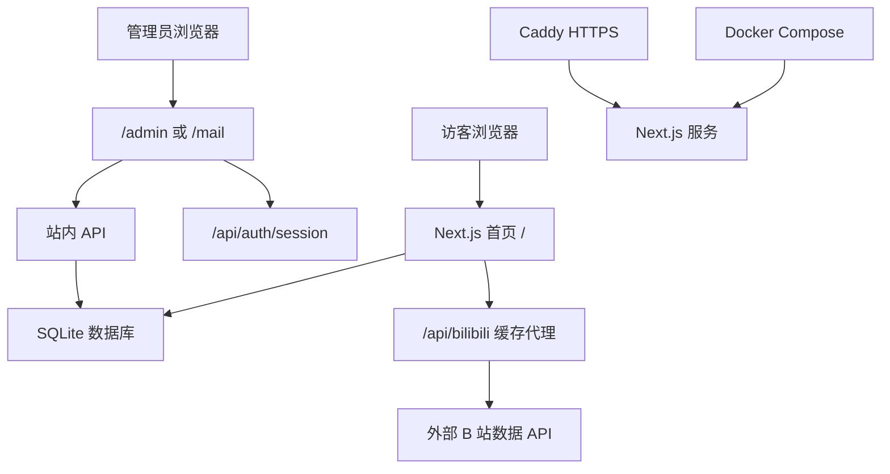

# 星眠Mia · 云端教堂

星眠Mia 官方主站。

这是一个面向虚拟主播「星眠Mia」的内容展示与互动网站，包含首页展示、直播信息、Live2D/立绘展示、视频归档、歌单系统、匿名发信箱、后台配置、PWA 离线访问和部署维护工具。

项目已经进入部署状态，请特别注意：**数据库、`.env.local`、用户上传资源不应提交到 GitHub，也不应在升级时被覆盖。**

## 目录

- [项目能力](#项目能力)
- [页面入口](#页面入口)
- [技术栈](#技术栈)
- [架构说明](#架构说明)
- [目录结构](#目录结构)
- [本地开发](#本地开发)
- [环境变量](#环境变量)
- [数据库与持久化文件](#数据库与持久化文件)
- [常用脚本](#常用脚本)
- [部署与升级](#部署与升级)
- [安全与运行策略](#安全与运行策略)
- [API 概览](#api-概览)
- [维护检查清单](#维护检查清单)

## 项目能力

### 主站展示

- 星眠Mia 首页视觉展示
- Hero 首屏、状态区、立绘/模型区、视频区、歌单区、页脚
- 首页内容从 SQLite 配置读取，可通过后台更新
- 首屏服务端渲染，方便搜索引擎抓取标题、介绍、歌单等内容
- B 站数据通过站内代理 `/api/bilibili` 获取，带缓存和失败兜底

### 歌单系统

- SQLite 持久化歌曲列表
- 首页展示歌单分类、搜索、随机点歌等交互
- 后台可保存站点配置和歌曲数据
- 首页输出 MusicPlaylist JSON-LD，给搜索引擎更多结构化信息

### 匿名发信箱

- 公开页面可提交匿名来信
- 支持多个收件主题
- 支持开启/暂停主题
- 支持后台阅读、收藏、标记、归档、删除
- 支持敏感词、黑名单、发送频率限制
- 可选 Cloudflare Turnstile；未配置时仍保留 IP/指纹限流

### 后台管理

- `/admin` 管理主站配置和资源
- `/mail` 管理发信箱
- 登录使用服务端 HttpOnly Cookie session
- 请求不再反复携带真实密码，降低前端泄漏风险
- 登录失败记录与限流记录写入 SQLite，服务重启后不会全部清空

### PWA 与移动体验

- 支持 manifest、service worker、离线页
- 支持移动端入口 `/m`
- 支持安装提示和更新提示

## 页面入口

| 路径 | 说明 |
| --- | --- |
| `/` | 主站首页 |
| `/admin` | 主站配置后台 |
| `/mail` | 发信箱后台 |
| `/m` | 移动端入口 |
| `/m/[slug]` | 移动端主题页 |
| `/offline` | PWA 离线页 |
| `/manifest.webmanifest` | PWA manifest |
| `/sitemap.xml` | sitemap |
| `/robots.txt` | robots |

## 技术栈

| 分类 | 使用内容 |
| --- | --- |
| 框架 | Next.js 16 App Router |
| 渲染 | Server Components + Client Components + Route Handlers |
| 前端 | React 18、TypeScript、Tailwind CSS v4 |
| 动效 | Framer Motion、GSAP、Three.js |
| 数据库 | SQLite、`sqlite3` |
| 图标 | `tdesign-icons-react` |
| 发信箱组件 | vendored `@windchime/embed` |
| 弹窗 | SweetAlert2 |
| 部署 | Docker Compose + Caddy |
| Node | Node.js 20.x |

## 架构说明

这个项目不是纯静态站，也不是传统意义上所有页面都 SSR 的站。更准确地说，它是：

**Next.js App Router Hybrid Rendering 架构**

也就是几种方式混合使用：

- 首页 `/`：服务端读取 SQLite，先渲染出首屏 HTML，再交给客户端接管交互。
- 后台 `/admin`、`/mail`：偏客户端应用，通过 API 读写数据。
- API：使用 Next.js Route Handlers，例如 `/api/config`、`/api/mail/*`、`/api/bilibili`。
- PWA 与 SEO：由 `manifest`、`robots`、`sitemap`、service worker 和结构化数据共同支持。
- 数据持久化：SQLite 文件保存在服务器本地，不跟随 GitHub 更新。

简化流程：



## 目录结构

```text
app/
  page.tsx                    首页 Server Component
  admin/                      主站后台页面
  mail/                       发信箱后台页面
  m/                          移动端页面
  api/                        Next.js API Route Handlers
  manifest.ts                 PWA manifest
  robots.ts                   robots
  sitemap.ts                  sitemap
  offline/                    离线页

components/
  HomeClient.tsx              首页客户端交互主体
  Dashboard.tsx               首页主要展示区
  SongSystem.tsx              歌单系统
  Effects.tsx                 背景、光标、动效
  mail/                       发信箱相关组件

lib/
  db.ts                       SQLite 初始化与通用 helper
  site-data.ts                首页 SSR 数据读取
  site-config.ts              站点配置类型、默认值、清洗逻辑
  bilibili-api.ts             B 站数据格式化 helper
  session-auth.ts             HttpOnly Cookie session
  admin-auth.ts               管理后台鉴权
  mail-auth.ts                发信箱后台鉴权
  mail-rate-limit.ts          SQLite 持久化限流与登录失败锁
  mail-turnstile.ts           Turnstile 校验
  mail-topics.ts              发信箱主题逻辑

migrations/
  001_runtime_auth_and_rate_limit.sql

scripts/
  init-full-config.js         首次初始化站点配置和歌单
  backup-db.js                SQLite 备份
  migrate-db.js               数据库迁移
  seed-live-links.js          直播链接初始化/更新辅助
  update-bili-api.js          B 站 API 地址更新辅助

docs/
  DEPLOY_UPGRADE.md           部署升级说明

public/
  Mia.webp                    主视觉资源
  Background.webp             背景资源
  sw.js                       service worker
  video/                      本地视频
  memes/                      运行时资源目录，部署时持久化
  pic/                        运行时图片目录，部署时持久化
```

## 本地开发

### 1. 准备环境

```bash
nvm use
npm install
```

如果没有 `.env.local`：

```bash
cp .env.example .env.local
```

至少改掉这些值：

```env
ADMIN_PASSWORD=你的后台强密码
MAIL_AUTH_PASSWORD=你的发信箱后台密码
SESSION_SECRET=一段随机字符串
WINDCHIME_HASH_SALT=一段随机字符串
DATABASE_PATH=./codes.db
NEXT_PUBLIC_SITE_URL=http://localhost:3000
```

可以用下面命令生成随机字符串：

```bash
openssl rand -hex 32
```

### 2. 初始化数据库

首次本地运行时：

```bash
node scripts/init-full-config.js
npm run db:migrate
```

### 3. 启动开发服务器

```bash
npm run dev
```

打开：

- <http://localhost:3000/>
- <http://localhost:3000/admin>
- <http://localhost:3000/mail>

如果需要手机访问同一局域网里的开发服务：

```bash
npm run dev:mobile
```

## 环境变量

| 变量 | 必填 | 说明 |
| --- | --- | --- |
| `ADMIN_PASSWORD` | 是 | `/admin` 后台密码；如果未设置 `MAIL_AUTH_PASSWORD`，`/mail` 也会回退使用它 |
| `MAIL_AUTH_PASSWORD` | 推荐 | `/mail` 发信箱后台独立密码 |
| `SESSION_SECRET` | 推荐 | 服务端 session 签名密钥；生产环境建议单独设置 |
| `DATABASE_PATH` | 是 | SQLite 文件路径；本地默认可用 `./codes.db` |
| `NEXT_PUBLIC_SITE_URL` | 是 | 网站公开 URL，用于 OG、sitemap、robots 等 |
| `WINDCHIME_HASH_SALT` | 是 | 发信者指纹 hash 盐值；生产环境必须换成随机字符串 |
| `MAIL_BLOCKED_TERMS` | 否 | 初始敏感词，逗号分隔；数据库已有设置后以后台保存值为准 |
| `NEXT_PUBLIC_TURNSTILE_SITE_KEY` | 否 | Cloudflare Turnstile 前端 site key |
| `TURNSTILE_SECRET` | 否 | Cloudflare Turnstile 服务端 secret |
| `BILIBILI_CACHE_TTL_SECONDS` | 否 | B 站数据正常缓存时间，默认 120 秒 |
| `BILIBILI_STALE_TTL_SECONDS` | 否 | B 站上游失败时允许使用旧缓存的时间，默认 1800 秒 |

部署环境的 `.env.local` 不应提交到 GitHub。

## 数据库与持久化文件

项目使用 SQLite。默认数据库文件是：

```text
./codes.db
```

Docker 部署时数据库路径是：

```text
/app/data/codes.db
```

宿主机对应目录：

```text
./data/codes.db
```

### 主要数据表

| 表 | 说明 |
| --- | --- |
| `site_config` | 首页和站点配置 |
| `site_config_history` | 配置历史快照 |
| `songs` | 歌单 |
| `mail_topics` | 发信箱主题 |
| `mail_messages` | 匿名来信 |
| `mail_blocklist` | 发信黑名单 |
| `mail_settings` | 发信箱设置 |
| `runtime_rate_limits` | 运行时限流记录 |
| `runtime_login_failures` | 登录失败与锁定记录 |
| `schema_migrations` | 已执行数据库迁移记录 |

### 不要提交到 GitHub 的内容

这些内容属于部署环境本地资产：

```text
.env.local
codes.db
data/codes.db
backups/*.db
public/memes/
public/pic/
```

原因很简单：GitHub 上的代码可以更新，服务器上的数据库和上传资源要保留。否则更新代码时可能覆盖真实线上数据。

## 常用脚本

| 命令 | 说明 |
| --- | --- |
| `npm run dev` | 启动本地开发服务 |
| `npm run dev:mobile` | 允许局域网设备访问开发服务 |
| `npm run build` | 构建生产版本 |
| `npm run start` | 启动生产服务 |
| `npm run lint` | 运行 ESLint |
| `npm run db:backup` | 备份当前 SQLite 数据库 |
| `npm run db:migrate` | 执行未应用的数据库迁移 |
| `npm run clean` | 清理 `.next`、`out`、`build`、`node_modules` |

## 部署与升级

项目推荐使用 Docker Compose 部署。当前 `docker-compose.yml` 包含：

- `website`：Next.js 应用
- `caddy`：HTTPS 反向代理
- `./data:/app/data`：持久化数据库
- `./public/memes:/app/public/memes`：持久化运行时资源
- `./public/pic:/app/public/pic`：持久化图片资源

### 首次部署

1. 准备 `.env.local`

```bash
cp .env.example .env.local
```

2. 修改 `.env.local` 中的密码、密钥、域名。

3. 启动服务

```bash
docker compose build website
docker compose up -d
```

4. 初始化或迁移数据库

```bash
docker compose exec website npm run db:migrate
```

如果是全新数据库，还需要先初始化默认配置：

```bash
docker compose exec website node scripts/init-full-config.js
docker compose exec website npm run db:migrate
```

### 已部署网站升级

详细升级步骤见：

[docs/DEPLOY_UPGRADE.md](docs/DEPLOY_UPGRADE.md)

简版流程：

```bash
docker compose exec website npm run db:backup
git pull origin main
docker compose build website
docker compose up -d
docker compose exec website npm run db:migrate
curl -fsS https://你的域名/api/health
```

升级前先备份数据库。迁移脚本是幂等的：已执行过的迁移不会重复执行。

## 安全与运行策略

### 后台登录

后台登录流程：

1. 用户在 `/admin` 或 `/mail` 输入密码。
2. 前端调用 `/api/auth/session`。
3. 服务端验证密码。
4. 服务端写入 HttpOnly Cookie。
5. 后续请求靠 Cookie 鉴权，不再反复发送真实密码。

这样做的好处是：浏览器里的 JavaScript 不能读取 HttpOnly Cookie，即使前端脚本出问题，也更难直接拿到后台密码。

### 登录失败锁定

登录失败记录保存在 SQLite 的 `runtime_login_failures` 表里。

如果服务重启，失败记录仍然存在，不会因为重启而清空。

### 发信限流

发信限流保存在 SQLite 的 `runtime_rate_limits` 表里。

它保护的是运行状态，不属于核心业务数据。清理旧记录不会影响站点配置、歌单或来信。

### B 站数据缓存

首页不直接请求外部 B 站数据 API，而是请求站内：

```text
/api/bilibili
```

这个接口会：

- 正常情况下短时间缓存上一次成功结果
- 外部 API 偶发失败时，用旧缓存顶上
- 如果没有任何可用缓存，返回 502

这样可以减少外部接口不稳定对首页展示的影响。

### SEO 控制

`proxy.ts` 会给非公开入口加上 `x-robots-tag: noindex`。

允许索引的主要路径包括：

- `/`
- `/robots.txt`
- `/sitemap.xml`
- `/manifest.webmanifest`
- `/favicon.ico`
- `/og-image.jpg`
- `/app.jpg`

后台、API、移动页等默认不希望被搜索引擎索引。

## API 概览

| API | 方法 | 说明 |
| --- | --- | --- |
| `/api/config` | `GET` | 读取站点配置、歌单、发信箱状态 |
| `/api/admin/save` | `POST` | 保存主站配置和歌单 |
| `/api/admin/upload` | `POST` | 后台资源管理与上传 |
| `/api/auth/session` | `GET` / `POST` / `DELETE` | 查询、创建、清除后台 session |
| `/api/bilibili` | `GET` | B 站数据缓存代理 |
| `/api/health` | `GET` | 健康检查 |
| `/api/mail/topics` | `GET` / `POST` | 发信箱主题列表与创建 |
| `/api/mail/topics/[id]` | `PATCH` / `DELETE` | 更新或删除主题 |
| `/api/mail/topics/[id]/purge` | `POST` | 清理主题内容 |
| `/api/mail/messages` | `GET` / `POST` | 后台读取来信、公开提交来信 |
| `/api/mail/messages/[id]` | `PATCH` / `DELETE` | 更新或删除单条来信 |
| `/api/mail/messages/[id]/block` | `POST` | 拉黑某个发信者 |
| `/api/mail/messages/batch` | `POST` | 批量操作来信 |
| `/api/mail/blocklist` | `GET` / `POST` | 黑名单列表与新增 |
| `/api/mail/blocklist/[hash]` | `DELETE` | 删除黑名单记录 |
| `/api/mail/blocked-terms` | `GET` / `PUT` | 敏感词读取与保存 |
| `/api/mail/settings` | `GET` / `PUT` | 发信箱设置 |
| `/api/mail/proxy-image` | `GET` | 邮箱图片代理 |

## 维护检查清单

提交代码前：

```bash
npm run lint
npm run build
```

升级部署前：

```bash
npm run db:backup
```

升级部署后：

```bash
npm run db:migrate
curl -fsS https://你的域名/api/health
curl -fsS https://你的域名/api/bilibili
```

如果 `/api/health` 返回：

```json
{
  "ok": true
}
```

说明应用能正常访问数据库，数据库完整性检查也通过。

## 与旧 UliUli 站点的差异

这个项目从旧站点逻辑里保留了可复用部分，但已经围绕星眠Mia 重做了定位和功能边界。

已移除：

- 扭蛋 / 出金弹窗
- 隐藏歌单
- Konami 秘籍
- `/app` PWA 独立壳
- `/m/*` 多歌房
- 小游戏

已新增或重做：

- 星眠Mia 主题视觉与文案系统
- 主站 SSR 初始数据
- SQLite 配置后台
- 匿名发信箱主题管理
- HttpOnly Cookie session
- SQLite 持久化限流
- B 站数据缓存代理
- 健康检查接口
- 数据库备份与迁移脚本
- Docker Compose 部署说明
